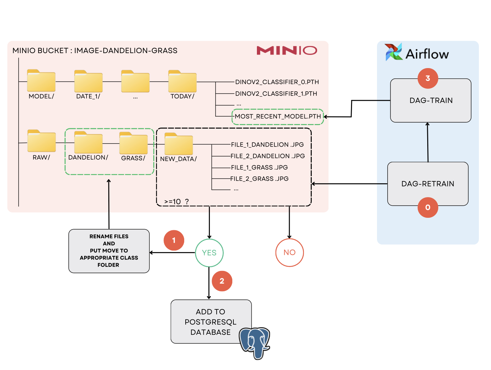

# MLOps_ClassifiImage

This project was realized for the MLOps course of the specialized Master’s AI Data expert & MLops. The objective is to develop a complete machine learning pipeline for image classification. It handles a binary classification task on an image dataset containing labeled “dandelion” and “grass” images.
A development environment was set for development and tests and a production environment allows the deployment on a Kubernetes cluster.

## 1. Global project architecture


Airflow orchestrates the pipeline for the download and storage of the database, training and serving of the model and retraining when new images are available. Monotoring of training is available through MlFlow. The classifier can be accessed via an API and via a Streamlit interface. New images uploaded to Streamlit are stored for further retraining of the model. Prometheus along with Grafana are used for the monitoring of the API use. Deployment is automatized via the CI/CD using Helm Charts.


## 2. Quick setup

## Dev environement

### Run Docker
For the 1st time
```bash
docker compose up -d -build
```
otherwise
```bash
docker compose up
```
### Run webapp
After running the docker compose, click on `streamlit` image to run the webapp brownser.


## Prod environement

## 3. Dataset
The dataset used in this project consists of RGB images labeled as either "dandelion" or "grass", intended for binary image classification.

The training and validation sets are manually curated and stored in MinIO.
Images can be added dynamically through the Streamlit interface, and manually validated by an admin before being used for retraining.
Images are collected from public datasets and user uploads. All data is centralized in an S3-compatible MinIO bucket, ensuring scalability, high availability, and seamless integration with the MLOps pipeline.

## 4. Storage

### in PostgreSQL
A PostgreSQL database keeps track of all the processed images. The **plants_data** table includes the following fields:

| Column Name | Description                       |
| ----------- | --------------------------------- |
| id          | Unique identifier (auto)          |
| url\_source | Original name or source URL       |
| label       | Image class (`dandelion`/`grass`) |
| url\_s3     | Full MinIO path to the image      |

### in Minio Bucket: ```image-dandelion-grass```

MinIO is used as the central object store for both training/inference images and serialized model weights. It provides a lightweight, self-hosted, and S3-compatible storage solution integrated into the entire MLOps workflow.

The project stores data inside the image-dandelion-grass bucket, following the structure below:

``` bash
image-dandelion-grass/
├── model/
│   ├── YYYY-MM-DD/               # Folder per training date
│   │   ├── dinov2_classifier_0.pth
│   │   ├── dinov2_classifier_1.pth
│   │   └── ...                   # Multiple versions for each training session
├── raw/
│   ├── dandelion/                # Manually validated images labeled "dandelion"
│   ├── grass/                    # Manually validated images labeled "grass"
│   └── new_data/
│       ├── pending_validation/   # User-submitted images awaiting admin validation
│       └── corrected_data/       # Admin-labeled and approved images 
```

A DAG in Airflow periodically checks for new validated images in corrected_data/. When 10 or more new images are available, they are:

1. Moved to their appropriate class folders (raw/dandelion/ or raw/grass/),
2. Registered in a PostgreSQL database, which stores metadata including the file name, label, and full MinIO URL,
3. Used to automatically retrain the classification model.


## 4. Storage

- Production environment

Structure of minio-chart to deploy on Kubernetes with Helm:
```bash
└── minio-chart # Top-level folder for charts
    └──Chart.yaml #
    └──values.yaml #
    └──templates  #
        └──minio-deployment.yaml
        └──minio-service.yaml
```

Command line for running the `minio` release with the official template Bitnami

```bash
helm install minio bitnami/minio \
  --set rootUser=minioadmin \
  --set rootPassword=minioadmin
```

## 5. Model architecture

Our goal is to build a binary image classification model that distinguishes between images of **dandelion** and **grass**. \
The input to the model is a single RGB image, resize to 224x224 pixels and the output is a binary prediction : either class 0 (dandelion) or class 1 (grass).

### Architecture overview
We use the DINOv2 vision transformer model as a feature extractor. DINOv2 is a self-supervised vision transformer retrained on large-scale image datasets. Specifically, we use the ViT-S/14 variant of DINOv2 without fine-tuning its internal weights. Instead of, we extract a feature embedding from the [CLS] token of the last transformer layer. The DINOv2 output is passed through a simple classification head. We freeze the DINOv2 backbone and train only the classification head. The model is trained using binary cross-entropy loss, optimized with Adam at learning rate of 0.003.

The model achieves more **90%** accuracy on the test set and shows good generalization on both sunny and shaded outdoor scenes.

## 6. Automated pipeline
- Production environment

Structure of airflow-chart to deploy on Kubernetes with Helm:
```bash
└── airflow-chart # Top-level folder for charts
    └──Chart.yaml #
    └──values.yaml #
    └──templates  #
        └──airflow-init-deployment.yaml
        └──airflow-scheduler-deployment.yaml
        └──airflow-triggerer-deployment.yaml
        └──airflow-webserver-deployment.yaml
        └──airflow-init-cm0-configmap.yaml
```
Command line for running the `airflow` release

```bash
helm install myrelease apache-airflow/airflow -f values.yaml \
    --namespace airflow --create-namespace
```

## 7. Inference on the model

There are two ways for the user to interact with the model in inference mode.

### Via the API

Structure of the /api folder:

```bash
├── ../MlOpsClassifiImage       # Implementation of classifier with MlOps pipeline
│
└── api                  # Top-level folder for inference on the api
    └──Dockerfile.api    # Dockerfile for the api via FastAPI
    └──main.py           # Script to initialize the api via FastAPI and handle requests
    └──requirements.txt  # Requirements for the FastAPI module
```

- Dev environment
The API is accessible at the url : http://localhost:8000. A prediction can be made using the following command :

```bash
curl -X POST http://localhost:8000/predict \
  -H "accept: application/json" \
  -H "Content-Type: multipart/form-data" \
  -F "file=@/path/to/your/image.jpg"
```
### TODO
- Production environment

Structure of fastapi-chart to deploy on Kubernetes with Helm:
```bash
└── fastapi-chart # Top-level folder for charts
    └──Chart.yaml #
    └──values.yaml #
    └──templates  #
        └──deployment.yaml
        └──service.yaml
```

### Via Streamlit

Structure of the /streamlit folder:

```bash
├── ../MlOpsClassifiImage       # Implementation of classifier with MlOps pipeline
│
└── streamlit                  # Top-level folder for interaction via Streamlit
    ├── webapp              # setup for the streamlit interface
    │   └──app_streamlit.py   # main script for the interaction via Streamlit
    │            
    └── Dockerfile.streamlit  # Dockerfile for the streamlit module
    └── requirements.txt      # requirements for the streamlit module
```

- Dev environment

The Streamlit app is accessible at the url : http://localhost:8501. A prediction can be obtained by directly drag and dropping an image or uploading from your local machine.

### TODO last version of screenshot streamlit
### TODO prod env


## 8. Monitoring of usage

Monitoring of the API usage is setup using Prometeus and Grafana. Prometheus scraps the metrics of API usage and Streamlit interactions while Grafana connects to Prometheus as a data source and is used to build dashboards.

Structure of the monitoring folder :

```bash
├── ../MlOpsClassifiImage       # Implementation of classifier with MlOps pipeline
│
├── monitoring                  # Top-level folder for monitoring stack (Prometheus, Grafana)
│   └──prometheus.yml           # Main configuration file for Prometheus (scrape jobs, targets)
│
└── grafana                     # Grafana setup for visualization
    ├── dashboards              # JSON files, templates for presetup dashboards
    │   └──fastapi_dashboard.json   # dashboard for API request metrics
    │   └──streamlit_dashboard.json # dashboard for Streamlit usage metrics
    │
    └── provisioning            # Auto-provisioning setup for datasources and dashboards
        ├──dashboards           # Provisioning config that tells Grafana to load the JSON dashboards
        │   └──dashboard.yml   # Config file mapping JSON files to folders/titles
        └──datasources          # Provisioning config for Prometheus data source
            └──datasources.yml  # Points Grafana to Prometheus URL
```


In the development environment the dashboards are accessible at the url : http://localhost:3000


### TODO Prod environment ?

### API monitoring

The API monitoring dashboard is set up to display POST and GET requests (predictions fall under the POST requests category). It combines numbers for the requests done directly to the API and requests done through Streamlit.


### Streamlit monitoring

The Streamlit monitoring dashboard is set up to display page views and total predict button clicks.


## 4. Conclusion and next steps
