# MLOps_ClassifiImage

This project was realized for the MLOps course of the specialized Master’s AI Data expert & MLops. The objective is to develop a complete machine learning pipeline for image classification. It handles a binary classification task on an image dataset containing labeled “dandelion” and “grass” images.
A development environment was set for development and tests and a production environment allows the deployment on a Kubernetes cluster.


## 1. Global project architecture

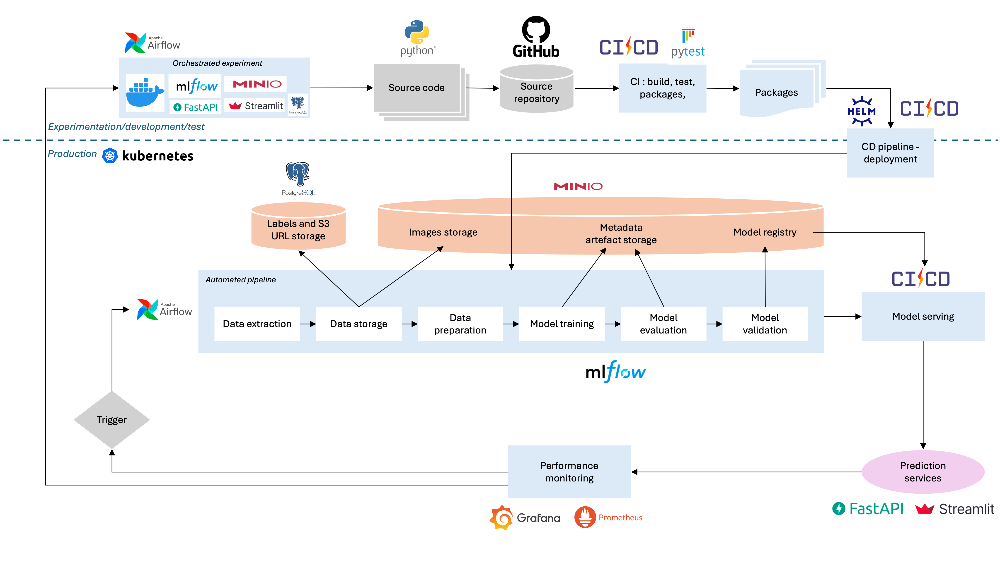

Airflow orchestrates the pipeline for the download and storage of the database, training and serving of the model and retraining when new images are available. Monotoring of training is available through MlFlow. The classifier can be accessed via an API and via a Streamlit interface. New images uploaded to Streamlit are stored for further retraining of the model. Prometheus along with Grafana are used for the monitoring of the API use. Deployment is set up on a Kubernetes cluster 
using Helm Charts.


## 2. Quick setup

Start by cloning the repositery
```bash
git clone https://github.com/nnmp020395/MLOps_ClassifiImage
```

### Dev environement

* Run Docker


For the 1st time
```bash
docker compose up -d --build
```
otherwise
```bash
docker compose up
```

All custom docker images for the project are also available at : https://hub.docker.com/r/dessalinesdarryl/mlops_classifimage/

Official images from grafana (grafana/grafana:latest), postgres (postgres:13) and prometheus (prom/prometheus:latest) are also used in the docker-compose.yaml file.

* First training

Go to the url http://localhost:8080 to access the airflow webserver and trigger the **mlops_project_get_store_images** dag. This will download the images for the database and store them, then trigger a first training of the model to make the API accessible.
In development mode, airflow webserver default password and user name are set to "airflow".


* Run the webapp

After running the dag, go to http://localhost:8501 to access the webapp.
You can then upload in image to get a prediction.


## 3. Dataset

Images are collected from public datasets and user uploads. All data is centralized in an S3-compatible MinIO bucket, ensuring scalability, high availability, and seamless integration with the MLOps pipeline.

The core dataset used in this project consists of RGB images labeled as either "dandelion" or "grass", intended for binary image classification, available at https://github.com/btphan95/greenr-airflow/tree/master/data.

<div style="display: flex; justify-content: space-between;">
  <figure style="width: 49%; text-align: center;">
    
    <figcaption>Grass image example</figcaption>
  </figure>
  <figure style="width: 49%; text-align: center;">
    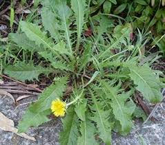
    <figcaption>Dandelion image example</figcaption>
  </figure>
</div>


Starting from this database, the training and validation sets are automatically curated and stored in MinIO.

The training database is also dynamically enriched using images added through the Streamlit interface. Labels of images are manually validated by an admin before being used for retraining.


## 4. Storage

### in PostgreSQL
A PostgreSQL database keeps track of all the processed images. The **plants_data** table includes the following fields:

| Column Name | Description                       |
| ----------- | --------------------------------- |
| id          | Unique identifier (auto)          |
| url\_source | Original name or source URL       |
| label       | Image class (`dandelion`/`grass`) |
| url\_s3     | Full MinIO path to the image      |

### in Minio Bucket: ```image-dandelion-grass```

MinIO is used as the central object store for both training/inference images and serialized model weights. It provides a lightweight, self-hosted, and S3-compatible storage solution integrated into the entire MLOps workflow.

The project stores data inside the image-dandelion-grass bucket, following the structure below:

``` bash
image-dandelion-grass/
├── model/
│   ├── YYYY-MM-DD/               # Folder per training date
│   │   ├── dinov2_classifier_0.pth
│   │   ├── dinov2_classifier_1.pth
│   │   └── ...                   # Multiple versions for each training session
├── raw/
│   ├── dandelion/                # Manually validated images labeled "dandelion"
│   ├── grass/                    # Manually validated images labeled "grass"
│   └── new_data/
│       ├── pending_validation/   # User-submitted images awaiting admin validation
│       └── corrected_data/       # Admin-labeled and approved images
```

A DAG in Airflow periodically checks for new validated images in corrected_data/. When 10 or more new images are available, they are:

1. Moved to their appropriate class folders (raw/dandelion/ or raw/grass/),
2. Registered in a PostgreSQL database, which stores metadata including the file name, label, and full MinIO URL,
3. Used to automatically retrain the classification model.

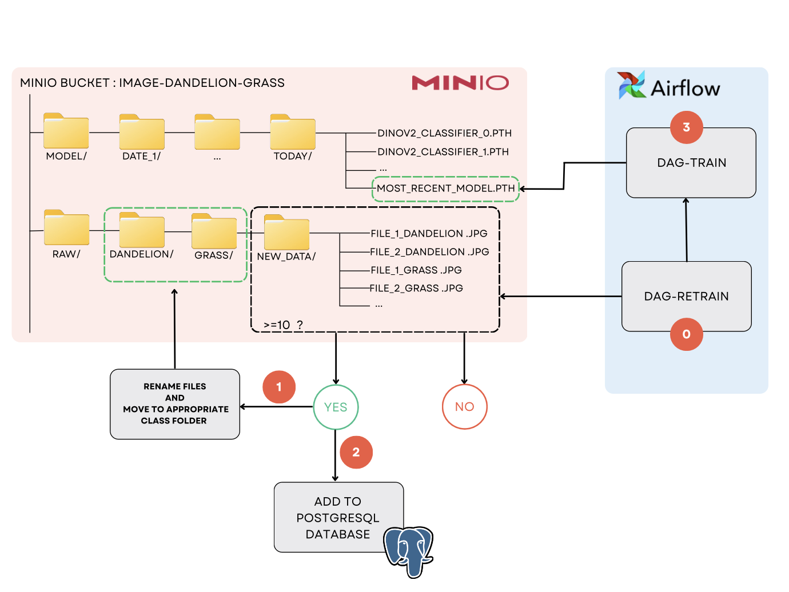


## 5. Model training

Our goal is to build a binary image classification model that distinguishes between images of **dandelion** and **grass**. \
The input to the model is a single RGB image, resize to 224x224 pixels and the output is a binary prediction : either class 0 (dandelion) or class 1 (grass).

### Architecture overview
We use the DINOv2 vision transformer model as a feature extractor. DINOv2 is a self-supervised vision transformer retrained on large-scale image datasets. Specifically, we use the ViT-S/14 variant of DINOv2 without fine-tuning its internal weights. Instead of, we extract a feature embedding from the [CLS] token of the last transformer layer. The DINOv2 output is passed through a simple classification head. We freeze the DINOv2 backbone and train only the classification head. The model is trained using binary cross-entropy loss, optimized with Adam at learning rate of 0.003.


The model achieves more than **90%** accuracy on the test set and shows good generalization on both sunny and shaded outdoor scenes.

Structure of the folders for model training and monitoring with Mlflow:

```bash
├── ../MlOpsClassifiImage       # Implementation of classifier with MlOps pipeline
    └── mlflow # main folder for the creation of the mlflow module
    │   └──Dockerfile.mlflow # docker file for the mlflow module
    │   └──requirements.txt # requirements for the mlflow module
    │
    └── src # main folder for model creation, training and monitoring functions
        └──mlflow_tracking.py   # training and monitoring with mlflow
        └──model.py             # model architecture definition and loading from .pth
```

### Training monitoring with Mlflow

Mlflow is used for the monitoring of the training. It is accessible at the url: http://localhost:5001

The page is designed to allow monotoring of different training experiments, and displays the evolution of train accuracy and train loss for each experiment, along with the validation accuracy value.

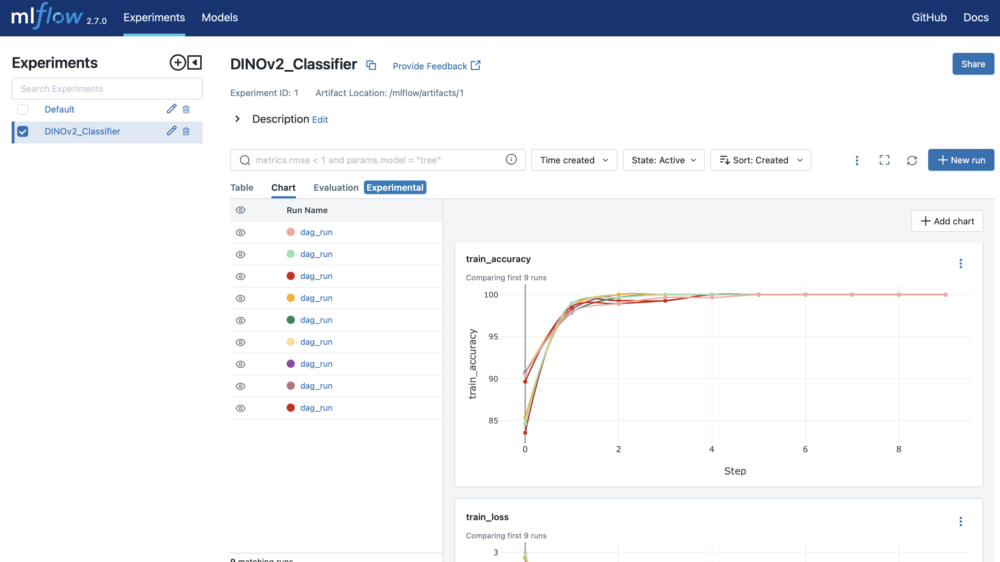


<div style="display: flex; justify-content: space-between;">
  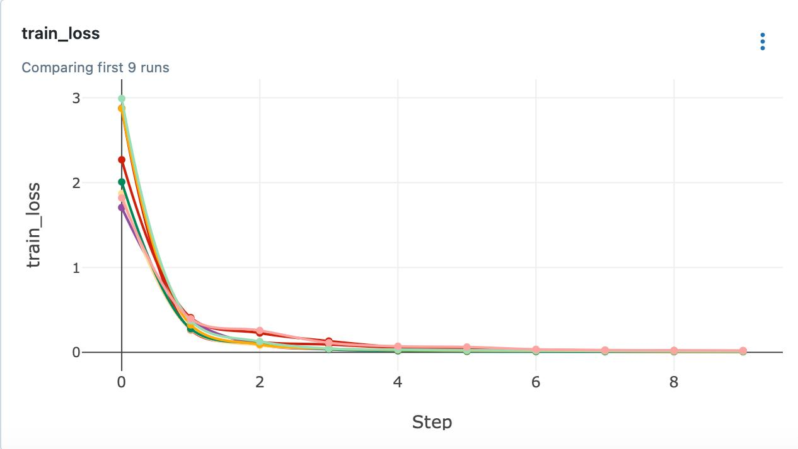
  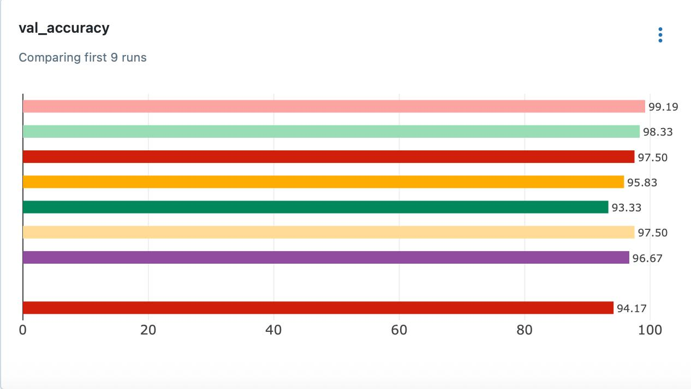
</div>


Acess to a specific run gives detailed information regarding the date of the run, duration, status, training parameters and metrics, as depicted below.

<div style="display: flex; justify-content: center;">
  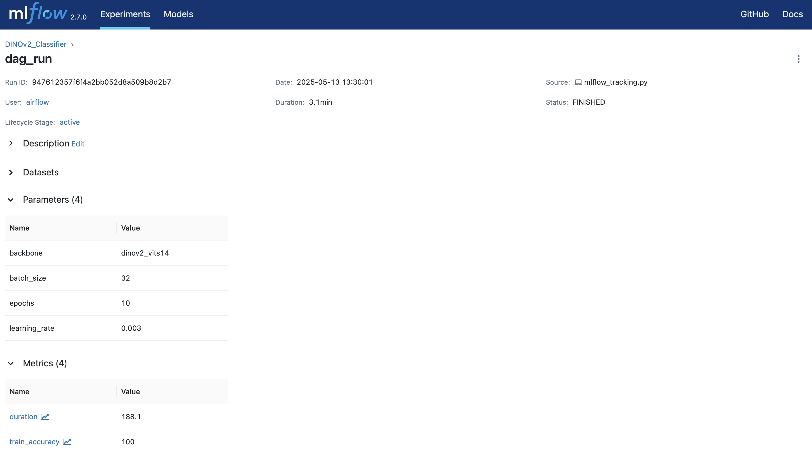
</div>


## 6. Automated pipeline with Airflow

- Dev environment :

Airflow webserver is accessible at the url: http://localhost:8080

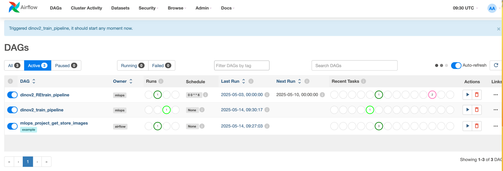

Three dependent dags are set to download the database, train the model, and trigger training if there are more than 10 new images in the database.

<div style="display: flex; justify-content: center;">
  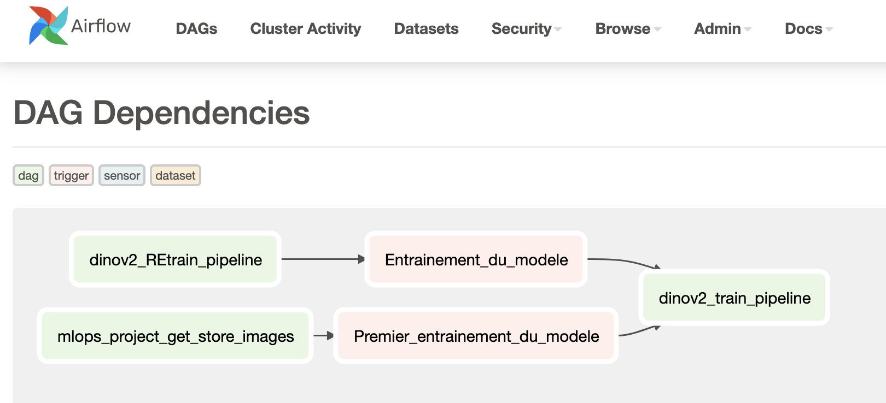
</div>


The first dag is useful at the beginning to download the images to Minio and create the SQL database to store the urls and labels of the images.


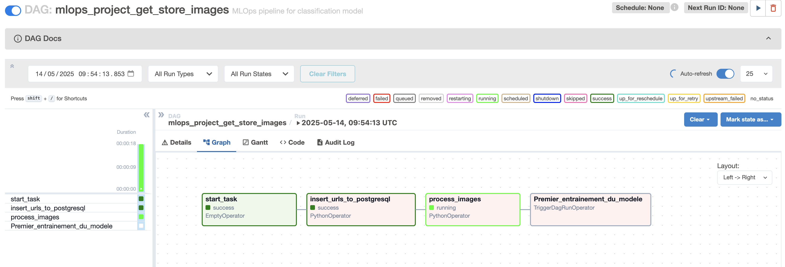

The last task triggers the training of the model with the downloaded images (2nd dag below).

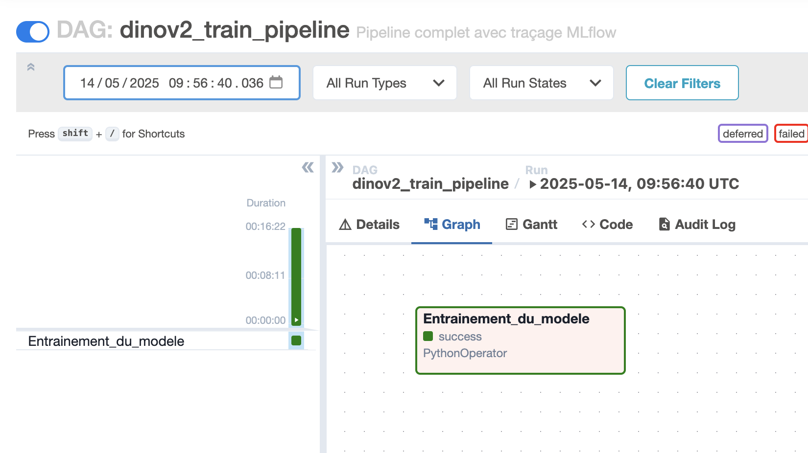


Once per week, the 3rd dag (below) is triggered and  heck if there are more than 10 new images in the database. If there are less than 10, it skips the 2 last tasks, other wise it moves the new images in the training folder and triggers the training dag.

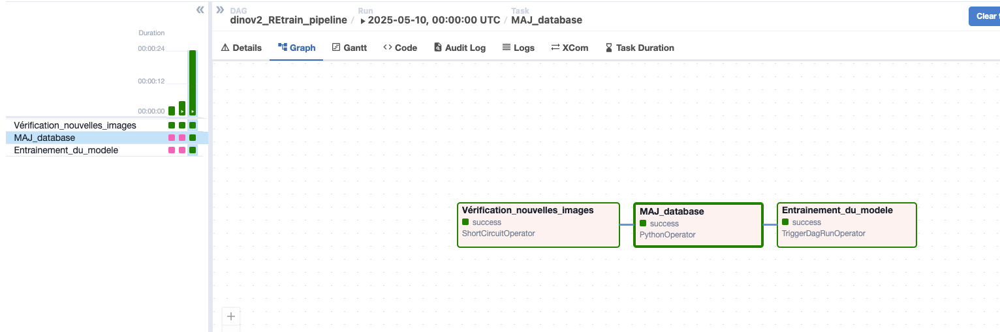


## 7. Inference on the model

There are two ways for the user to interact with the model in inference mode.

### Via the API

Structure of the /api folder:

```bash
├── ../MlOpsClassifiImage       # Implementation of classifier with MlOps pipeline
│
└── api                  # Top-level folder for inference on the api
    └──Dockerfile.api    # Dockerfile for the api via FastAPI
    └──main.py           # Script to initialize the api via FastAPI and handle requests
    └──requirements.txt  # Requirements for the FastAPI module
```

- Dev environment
The API is accessible at the url : http://localhost:8000. A prediction can be made using the following command :

```bash
curl -X POST http://localhost:8000/predict \
  -H "accept: application/json" \
  -H "Content-Type: multipart/form-data" \
  -F "file=@/path/to/your/image.jpg"
```

### Via Streamlit

Structure of the /streamlit folder:

```bash
├── ../MlOpsClassifiImage       # Implementation of classifier with MlOps pipeline
│
└── streamlit                  # Top-level folder for interaction via Streamlit
    ├── webapp              # setup for the streamlit interface
    │   └──app_streamlit.py   # main script for the interaction via Streamlit
    │
    └── Dockerfile.streamlit  # Dockerfile for the streamlit module
    └── requirements.txt      # requirements for the streamlit module
```

- Dev environment

The Streamlit app is accessible at the url : http://localhost:8501. A prediction can be obtained by directly drag and dropping an image or uploading from your local machine.


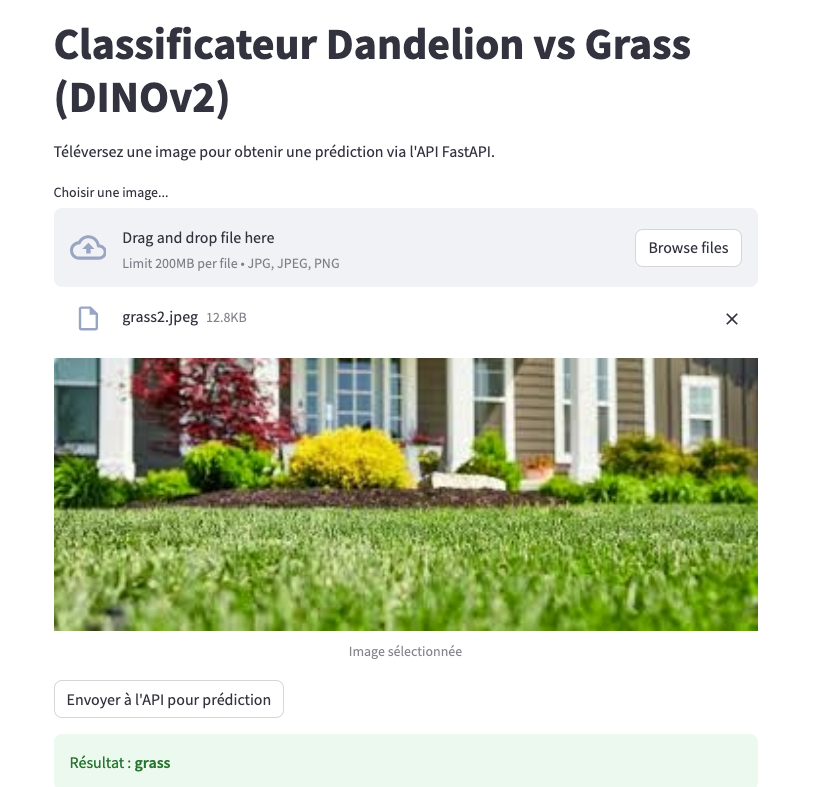

A second page, accessible with a password, allows an admin to check the label attributed to submitted images, correct it if necessary, and store the correctly labeled image in the minio database. These new images are then use for retraining the model.

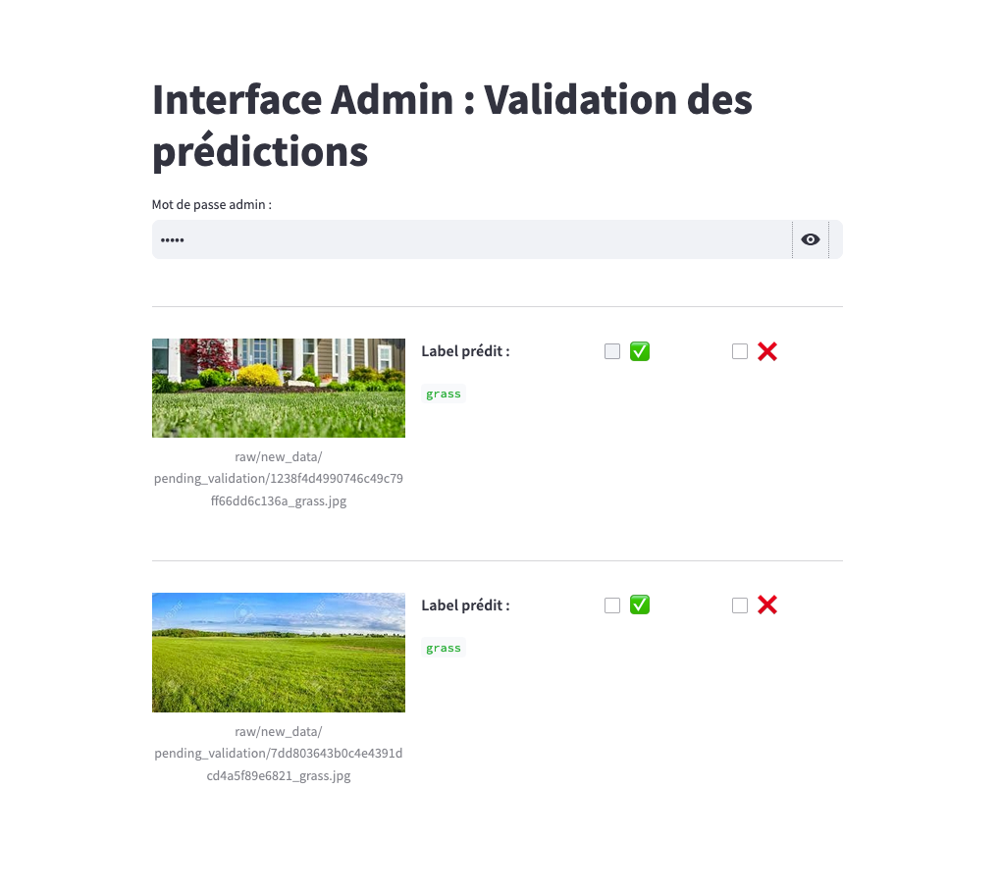


## 8. Monitoring of usage

Monitoring of the API usage is setup using Prometeus and Grafana. Prometheus scraps the metrics of API usage and Streamlit interactions while Grafana connects to Prometheus as a data source and is used to build dashboards.

Structure of the monitoring folder :

```bash
├── ../MlOpsClassifiImage       # Implementation of classifier with MlOps pipeline
│
├── monitoring                  # Top-level folder for monitoring stack (Prometheus, Grafana)
│   └──prometheus.yml           # Main configuration file for Prometheus (scrape jobs, targets)
│
└── grafana                     # Grafana setup for visualization
    ├── dashboards              # JSON files, templates for presetup dashboards
    │   └──fastapi_dashboard.json   # dashboard for API request metrics
    │   └──streamlit_dashboard.json # dashboard for Streamlit usage metrics
    │
    └── provisioning            # Auto-provisioning setup for datasources and dashboards
        ├──dashboards           # Provisioning config that tells Grafana to load the JSON dashboards
        │   └──dashboard.yml   # Config file mapping JSON files to folders/titles
        └──datasources          # Provisioning config for Prometheus data source
            └──datasources.yml  # Points Grafana to Prometheus URL
```

In the development environment the dashboards are accessible at the url : http://localhost:3000


### API monitoring

The API monitoring dashboard is set up to display POST and GET requests (predictions fall under the POST requests category). It combines numbers for the requests done directly to the API and requests done through Streamlit.

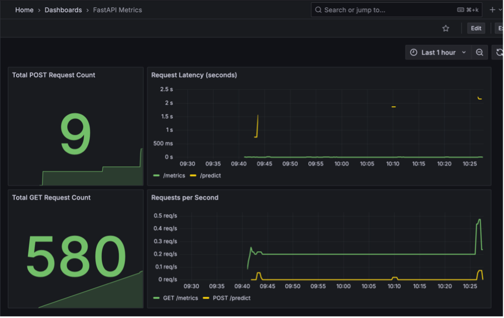

### Streamlit monitoring

The Streamlit monitoring dashboard is set up to display page views and total predict button clicks.

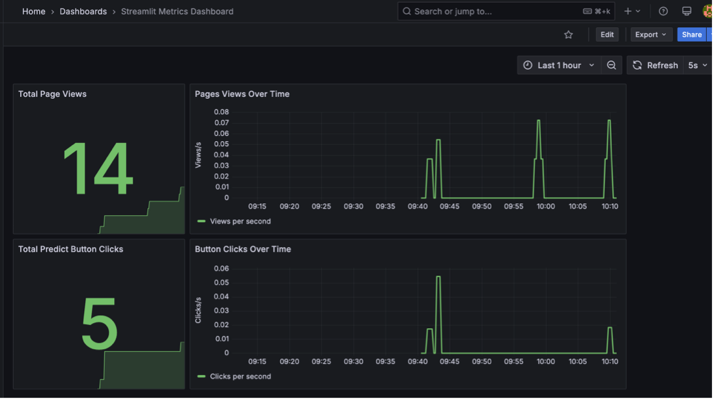


## 9. Production environment

Production deployment involves deploying these services to a local Kubernetes cluster via Helm Chart. For stable, reusable, and versioned production, Helm is preferred over the `kubectl apply` approach. YAML files are developed using official charts compatible with different applications.

We chose the Docker-desktop cluster, which is provided by Docker Desktop and allows us to deploy directly without the need to define a virtual machine or other installations.

### Installation Helm et les charts

Install Helm following the guide https://helm.sh/fr/docs/intro/install/

To get started, we first install the official chart repositories for Airflow, Minio, FastAPI, and MLFlow.
```bash
helm repo add apache-airflow https://airflow.apache.org/
helm repo add bitnami https://charts.bitnami.com/bitnami # Bitnami is compatible with Minio, MLFlow, Grafana & Prometheus
helm repo add fastapi-helm-chart https://anqorithm.github.io/fastapi-helm-chart/charts
helm repo add svtech https://svtechnmaa.github.io/charts/artifacthub/
helm update repo # to verify all installations above
```

Into `charts`, for each application, Helm will expect a directory structure that matches this:

```bash
├── charts
  └── app-chart
  │    └── Chart.yaml               # A YAML file containing information about the chart
  │    └── values.yaml              # The default configuration values for this chart
  │    └── templates                # sub-folder that contains deployment.yaml & service.yaml
  │        └── deployment.yaml      #
  │        └── service.yaml         #
  ├── app2-chart
  │
```

except Airflow, its directory is different:
```bash
├── charts
  └── airflow-chart
      └── Chart.yaml
      └── values.yaml
      └── templates
          └── airflow-init-deployment.yaml
          └── airflow-scheduler-deployment.yaml
          └── airflow-triggerer-deployment.yaml
          └── airflow-webserver-deployment.yaml
          └── airflow-init-cm0-configmap.yaml
```

### Deployment

Move into each app-chart and follow these steps below to deploy each application separately on cluster. We need deploy in order : Minio, Airflow & Postgres, FastApi, MLFlow, Grafana & Prometheus.

Firstly, verify the cluster context:

```bash
kubectl config current-context
```

**Minio** : move into `minio-chart`, follow these commands lines

```bash
cd charts/minio-chart
helm install minio bitnami/minio \
  --set rootUser=minioadmin \
  --set rootPassword=minioadmin
```
Run `kubectl port-forward --namespace default svc/minio 9001:9001` to open `localhost:9001`.

**Airflow** : use docker file `./airflow/Dockerfile.custom` and build an image that guides the chart find all DAGs:

```bash
cd airflow
docker build \
  -t mlops_classifiimage-airflow-custom:latest \
  -f Dockerfile.custom .
docker tag mlops_classifiimage-airflow-custom \
  nnmp020395/mlops_classifiimage-airflow-custom:latest
docker push nnmp020395/mlops_classifiimage-airflow-custom:latest
```
Then, move in the `airflow-chart`
```bash
cd charts/airflow-chart
helm install myrelease apache-airflow/airflow -f values.yaml --namespace airflow --create-namespace
```

**FastAPI, MLFlow, Streamlit**

Given the deployment steps above, not only Airflow but Minio also require Docker images for deployment to Kubernetes. Repeat the above steps directly using the Dockerfile located in the `./api/Dockerfile.fastapi`, `./mlflow/Dockerfile.mlflow`, and `./streamlit/Dockerfile.streamlit` directories.

The names of these images begin with <mlops_classifiimage-app-name>

The subsequent installation of releases is performed based on the helm.


### Port-forward

Each application contains a configured port through which the deployment results can be interpreted. During a successful installation, you must follow the builds to retrieve the logins and passwords for the `localhost`.

**Minio** : http://localhost:9001
```bash
helm status minio
kubectl port-forward --namespace default svc/minio 9001:9001
export ROOT_USER=$(kubectl get secret --namespace default minio -o jsonpath="{.data.root-user}" | base64 -d)
export ROOT_PASSWORD=$(kubectl get secret --namespace default minio -o jsonpath="{.data.root-password}" | base64 -d)
echo $ROOT_USER
echo $ROOT_PASSWORD
```
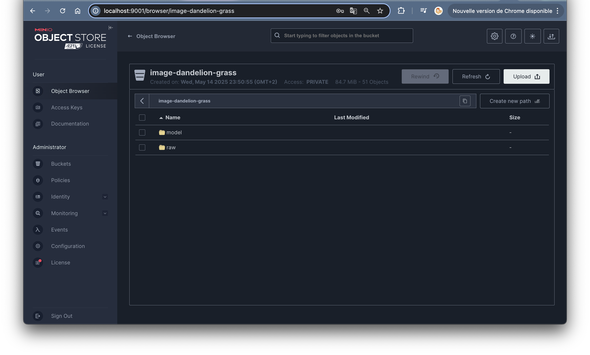

**Airflow** : http://localhost:8080
```bash
helm status airflow -n airflow
kubectl port-forward svc/myrelease-webserver 8080:8080 --namespace airflow
```
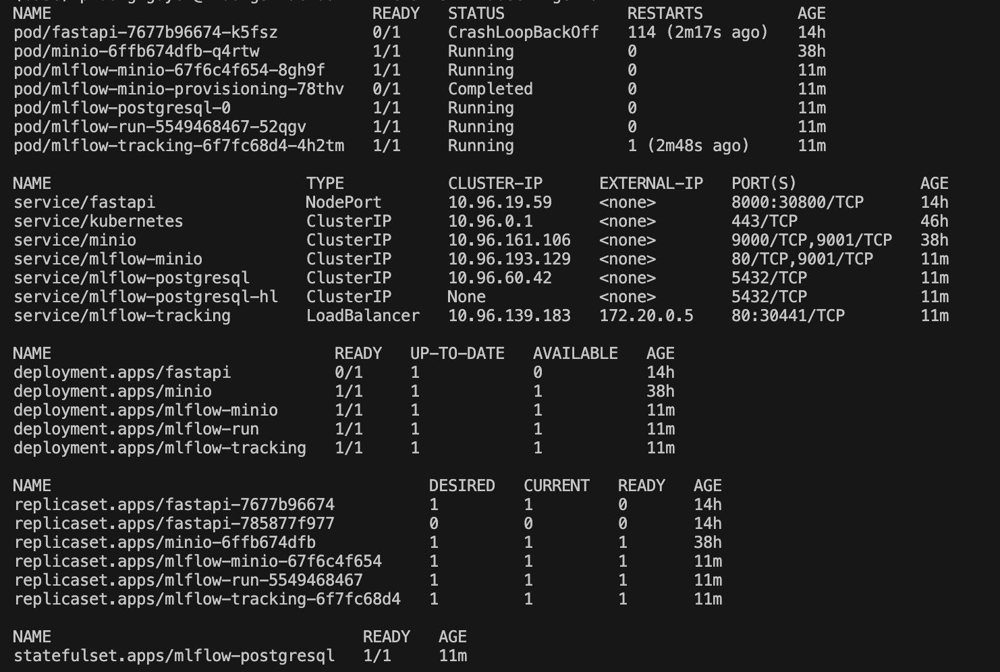
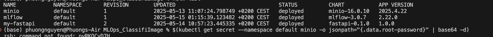

Note: This production portion has yet to be deployed; the charts show conflicts between applications. If you borrow existing Docker images, the releases fail to be linked together to be able to retrieve the database and DAGs.


## 10. Conclusion and next steps

This project allows to set up a functioning MlOps pipeline for a classification model.

To further improve it, we could in the future integrate a vector database to store and manage image embeddings within a feature store. By extracting feature vectors from images using our trained model and storing them in a vector database such as Chroma, FAISS, Pinecone, or Weaviate, we could enable mode efficient similarity search, and deduplication when storing images uploaded on streamlit. Incorporating this into the MLOps workflow would make it more scalable and production-ready. 

Another improvement would be to save the retrained model on MinIO and expose the it on the API only if certain criteria are met (for example, a threshold on test accuracy). This safeguard has not yet been implemented. 

As food for thought, whereas the dandelion/grass classification task is quite easy, we could also try harder tasks such as rocket salad / dandelion leaves classification, what do you think : 


<div style="display: flex; justify-content: space-between;">
<figure style="width: 100%; text-align: center;">
  
  
  <figcaption>Dandelion or Rocket Salad ???</figcaption>
  </figure>
</div>
